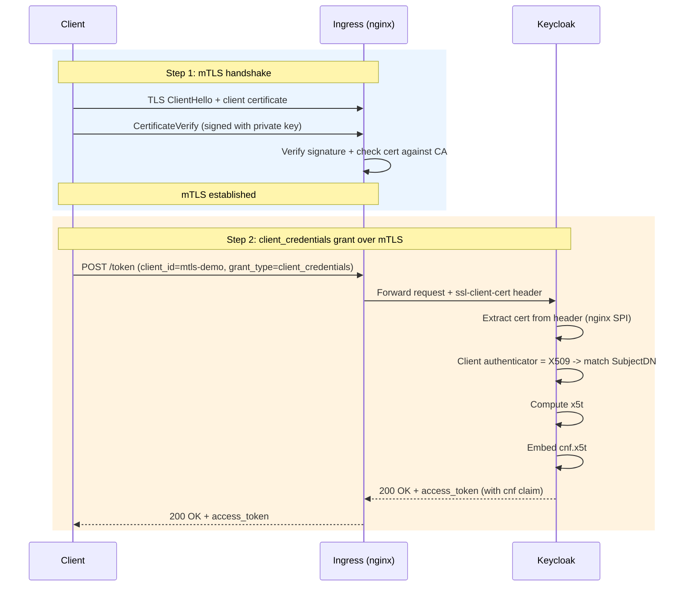
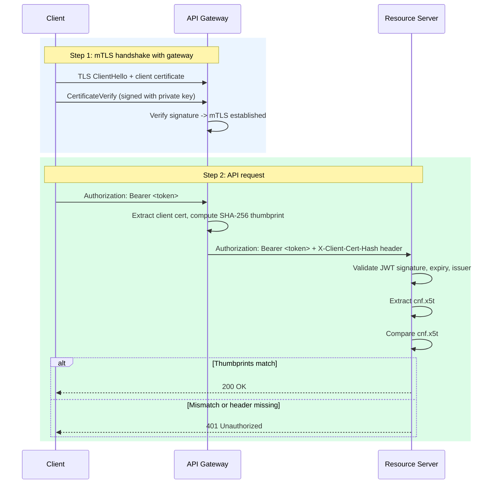
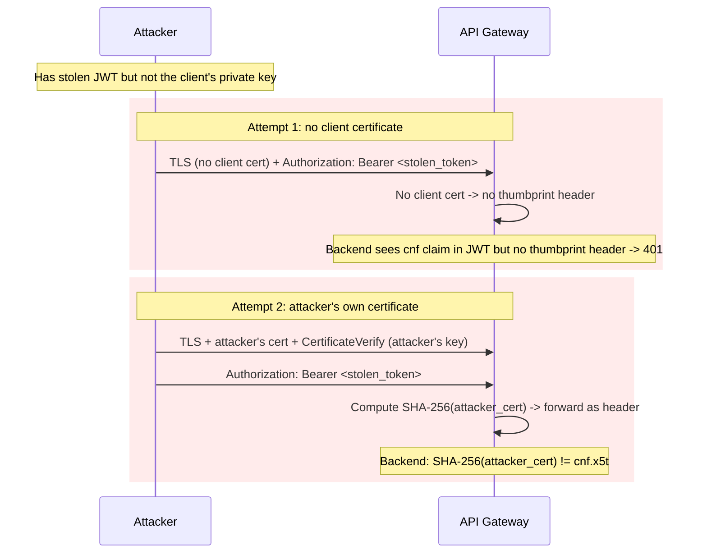

# mTLS Certificate-Bound Token Demo

RFC 8705 (OAuth 2.0 Mutual-TLS Client Authentication and Certificate-Bound Access Tokens) demo against the lab Keycloak instance.

The demo shows how a client authenticates to the authorization server using a TLS client certificate, and how the resulting access token is cryptographically bound to that certificate via the `cnf.x5t#S256` claim.

## How it works

### Token request - mTLS then client_credentials

Two things happen in sequence: first the mTLS handshake (where the client proves private key ownership), then the OAuth `client_credentials` grant runs over that connection.



The ingress is configured with `auth-tls-verify-client: optional` - it requests a client cert but does not require one. Clients without certs (e.g. `spa-token-demo`) connect normally on the same ingress. Keycloak decides per-client whether a certificate is required.

### Token verification at resource server (gateway pattern)

In practice, the resource server sits behind a gateway (like ingress-nginx). The client does mTLS with the gateway, and the gateway forwards the certificate thumbprint to the backend as a trusted header. The backend compares this header with the `cnf.x5t#S256` claim in the JWT.



The backend never sees the TLS connection directly - it trusts the thumbprint header from the gateway. The gateway must strip any client-provided `X-Client-Cert-Hash` before setting its own.

### What happens when a token is stolen

The attacker has the JWT but not the client's private key. Without the private key, they cannot complete the CertificateVerify step of the mTLS handshake with the gateway.



## Reproducing from scratch

This section walks through every step needed to set up the demo on a fresh lab cluster.

### 1. Generate the client CA

The CA must have explicit `basicConstraints` and `keyUsage` extensions - without them, ingress-nginx rejects the certificate with "x509: malformed extension value field".

```bash
openssl req -x509 -newkey rsa:2048 -nodes -days 365 \
  -keyout certs/client-ca.key \
  -out certs/client-ca.crt \
  -subj "/O=KSE Lab/CN=Client Certificate CA" \
  -addext "basicConstraints=critical,CA:TRUE" \
  -addext "keyUsage=critical,keyCertSign,cRLSign"
```

### 2. Create the Kubernetes secret for the CA

ingress-nginx needs the CA cert to verify client certificates:

```bash
kubectl create secret generic client-ca \
  --from-file=ca.crt=certs/client-ca.crt \
  -n keycloak
```

### 3. Configure ingress-nginx and Keycloak

Add annotations to the Keycloak Ingress:

```yaml
# ingress.yaml
annotations:
  nginx.ingress.kubernetes.io/auth-tls-verify-client: "optional"
  nginx.ingress.kubernetes.io/auth-tls-secret: "keycloak/client-ca"
  nginx.ingress.kubernetes.io/auth-tls-pass-certificate-to-upstream: "true"
```

Add startup args to the Keycloak Deployment so it reads the client cert from the proxy header (TLS terminates at ingress, not at Keycloak):

```yaml
# deployment.yaml args (add to existing args list)
- --spi-x509cert-lookup-provider=nginx
- --spi-x509cert-lookup-nginx-ssl-client-cert=ssl-client-cert
```

The full diff is in [kse-labs-deployment PR #3](https://github.com/kse-bd8338bbe006/kse-labs-deployment/pull/3).

### 4. Create the Keycloak client

Get an admin token and create the `mtls-demo` client via the Admin REST API:

```bash
KC_URL="https://keycloak.192.168.50.10.nip.io"

TOKEN=$(curl -sk "$KC_URL/realms/master/protocol/openid-connect/token" \
  -d "grant_type=password" \
  -d "client_id=admin-cli" \
  -d "username=admin" \
  -d "password=admin" | jq -r .access_token)

curl -sk -X POST "$KC_URL/admin/realms/api-security/clients" \
  -H "Authorization: Bearer $TOKEN" \
  -H "Content-Type: application/json" \
  -d '{
    "clientId": "mtls-demo",
    "name": "mTLS Certificate-Bound Token Demo",
    "enabled": true,
    "publicClient": false,
    "clientAuthenticatorType": "client-x509",
    "standardFlowEnabled": false,
    "directAccessGrantsEnabled": true,
    "serviceAccountsEnabled": true,
    "protocol": "openid-connect",
    "attributes": {
      "x509.subjectdn": "O=KSE Lab,CN=mtls-demo-client",
      "x509.allow.regex.pattern.comparison": "false",
      "tls.client.certificate.bound.access.tokens": "true"
    }
  }'
```

The SubjectDN must be in RFC 2253 format (Java's default) - the order is reversed compared to OpenSSL's default output. OpenSSL shows `CN=mtls-demo-client, O=KSE Lab` but Keycloak expects `O=KSE Lab,CN=mtls-demo-client`. Use `openssl x509 -subject -nameopt RFC2253` to get the correct format.

### 5. Generate client certificates

Valid client certificate (SubjectDN matches the Keycloak client):

```bash
openssl req -newkey rsa:2048 -nodes \
  -keyout certs/client.key -out certs/client.csr \
  -subj "/O=KSE Lab/CN=mtls-demo-client"

openssl x509 -req -in certs/client.csr \
  -CA certs/client-ca.crt -CAkey certs/client-ca.key \
  -CAcreateserial -out certs/client.crt -days 365
```

Wrong certificate for negative testing (different CN, same CA):

```bash
openssl req -newkey rsa:2048 -nodes \
  -keyout certs/wrong.key -out certs/wrong.csr \
  -subj "/O=KSE Lab/CN=wrong-client"

openssl x509 -req -in certs/wrong.csr \
  -CA certs/client-ca.crt -CAkey certs/client-ca.key \
  -CAcreateserial -out certs/wrong.crt -days 365
```

## Lab infrastructure summary

| Component | Configuration | Purpose |
|---|---|---|
| ingress-nginx | `auth-tls-verify-client: optional` | Request client cert without requiring it |
| ingress-nginx | `auth-tls-pass-certificate-to-upstream: true` | Forward cert to Keycloak |
| ingress-nginx | `auth-tls-secret: keycloak/client-ca` | CA that signs client certificates |
| Keycloak | `--spi-x509cert-lookup-provider=nginx` | Read cert from proxy header instead of TLS |
| Keycloak | `--spi-x509cert-lookup-nginx-ssl-client-cert=ssl-client-cert` | Header name for client cert |

### Keycloak client: `mtls-demo`

- Client authenticator: **X509 Certificate**
- SubjectDN: `O=KSE Lab,CN=mtls-demo-client` (RFC 2253 format - reversed from OpenSSL default)
- Service accounts enabled: yes
- Grant type: `client_credentials`
- OAuth 2.0 Mutual TLS Certificate Bound Access Tokens: **enabled**

## Repository contents

```
certs/
  client-ca.crt    # CA certificate (self-signed, CN=Client Certificate CA, O=KSE Lab)
  client-ca.key    # CA private key (for signing new client certs)
  client.crt       # Valid client certificate (CN=mtls-demo-client, O=KSE Lab)
  client.key       # Valid client private key
  wrong.crt        # Certificate signed by same CA but different CN
  wrong.key        # Wrong client private key
test_mtls.py       # Test script - 4 tests covering the full RFC 8705 flow
```

## Running the tests

```bash
python3 test_mtls.py
```

The script runs 4 tests:

1. **Token request with valid certificate** - expects 200 with access token
2. **cnf claim verification** - decodes the JWT, extracts `cnf.x5t#S256`, computes the SHA-256 thumbprint of `client.crt`, and compares them
3. **Request without certificate** - expects 401
4. **Request with wrong certificate** - expects 401 (SubjectDN does not match)

Expected output:

```
=== Test 1: Token request with valid client certificate ===
  [PASS] Returns 200

=== Test 2: Verify cnf claim in access token ===
  { ... "cnf": { "x5t#S256": "g1zny1xzAb1j1WV-UaT1ZNB2jri2gFlrUepNDGTlCao" } ... }
  [PASS] cnf thumbprint matches certificate

=== Test 3: Token request without client certificate ===
  [PASS] Returns 401

=== Test 4: Token request with wrong client certificate ===
  [PASS] Returns 401

=== Results: 4 passed, 0 failed ===
```

## Manual testing

Request a certificate-bound token:

```bash
curl -sk --cert certs/client.crt --key certs/client.key \
  https://keycloak.192.168.50.10.nip.io/realms/api-security/protocol/openid-connect/token \
  -d "client_id=mtls-demo" \
  -d "grant_type=client_credentials"
```

Verify the thumbprint independently:

```bash
openssl x509 -in certs/client.crt -outform DER \
  | openssl dgst -sha256 -binary \
  | openssl base64 -A | tr '+/' '-_' | tr -d '='
# Output: g1zny1xzAb1j1WV-UaT1ZNB2jri2gFlrUepNDGTlCao
```

Decode the JWT payload:

```bash
TOKEN=$(curl -sk --cert certs/client.crt --key certs/client.key \
  https://keycloak.192.168.50.10.nip.io/realms/api-security/protocol/openid-connect/token \
  -d "client_id=mtls-demo" -d "grant_type=client_credentials" | jq -r .access_token)

echo "$TOKEN" | cut -d. -f2 | base64 -d 2>/dev/null | jq .
```

## Generating new client certificates

To issue a new client certificate signed by the lab CA:

```bash
# Generate key and CSR
openssl req -newkey rsa:2048 -nodes \
  -keyout my-client.key \
  -out my-client.csr \
  -subj "/O=KSE Lab/CN=mtls-demo-client"

# Sign with the CA
openssl x509 -req -in my-client.csr \
  -CA certs/client-ca.crt -CAkey certs/client-ca.key \
  -CAcreateserial -out my-client.crt -days 365

# Note: the CN must match what Keycloak expects.
# SubjectDN in RFC 2253 format (Java/Keycloak order): O=KSE Lab,CN=mtls-demo-client
```

## References

- [RFC 8705 - OAuth 2.0 Mutual-TLS Client Authentication and Certificate-Bound Access Tokens](https://datatracker.ietf.org/doc/html/rfc8705)
- [RFC 7800 - Proof-of-Possession Key Semantics for JWTs](https://datatracker.ietf.org/doc/html/rfc7800)
- [Keycloak Mutual TLS Client Certificate Bound Access Tokens](https://www.keycloak.org/docs/latest/server_admin/#_mtls-client-certificate-bound-tokens)
- [Lecture 5 slides - TLS, Certificate Management, and Token Binding](../lecture5-slides/)
