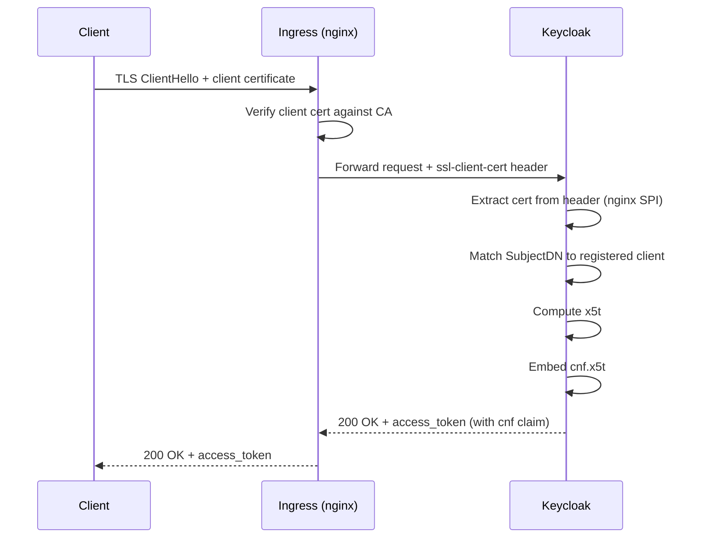
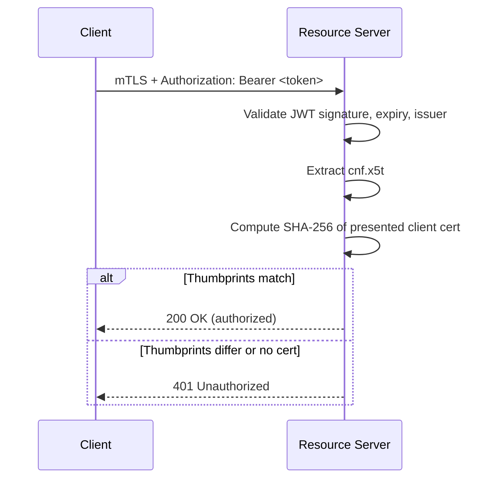
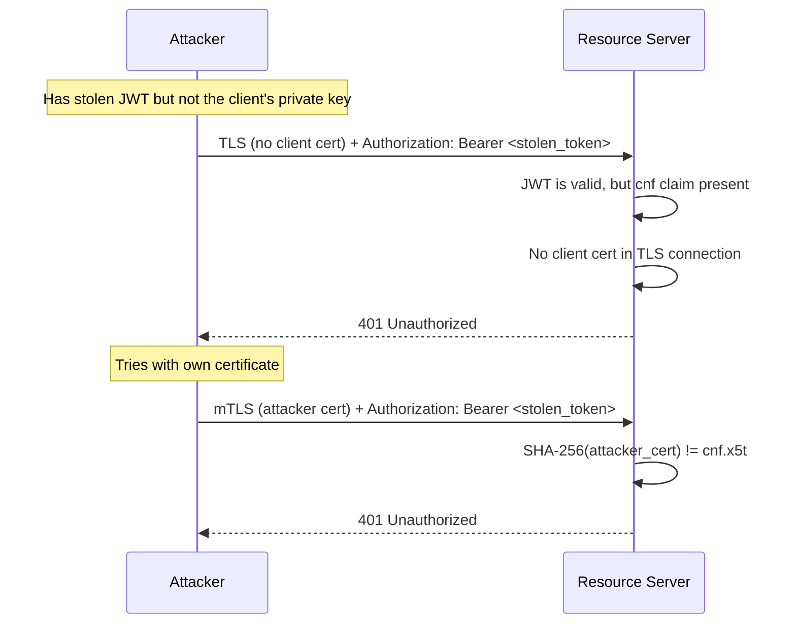

# mTLS Certificate-Bound Token Demo

RFC 8705 (OAuth 2.0 Mutual-TLS Client Authentication and Certificate-Bound Access Tokens) demo against the lab Keycloak instance.

The demo shows how a client authenticates to the authorization server using a TLS client certificate, and how the resulting access token is cryptographically bound to that certificate via the `cnf.x5t#S256` claim.

## How it works

### Token request with mTLS

The client presents its X.509 certificate during the TLS handshake. Keycloak verifies the certificate's SubjectDN against the registered client, then issues an access token containing a SHA-256 thumbprint of the client certificate.



### Token verification at resource server

When the client uses the token at a resource server, the RS extracts the thumbprint from the JWT and compares it with the certificate presented in the current TLS connection. A stolen token is useless without the matching private key.



### What happens when a token is stolen



## Lab infrastructure

The lab Keycloak at `keycloak.192.168.50.10.nip.io` is configured for mTLS via [kse-labs-deployment PR #3](https://github.com/kse-bd8338bbe006/kse-labs-deployment/pull/3):

| Component | Configuration | Purpose |
|---|---|---|
| ingress-nginx | `auth-tls-verify-client: optional` | Request client cert without requiring it |
| ingress-nginx | `auth-tls-pass-certificate-to-upstream: true` | Forward cert to Keycloak |
| ingress-nginx | `auth-tls-secret: keycloak/client-ca` | CA that signs client certificates |
| Keycloak | `--spi-x509cert-lookup-provider=nginx` | Read cert from proxy header instead of TLS |
| Keycloak | `--spi-x509cert-lookup-nginx-ssl-client-cert=ssl-client-cert` | Header name for client cert |

### Keycloak client: `mtls-demo`

- Client authenticator: **X509 Certificate**
- SubjectDN: `O=KSE Lab,CN=mtls-demo-client` (RFC 2253 format - reversed from OpenSSL default)
- Service accounts enabled: yes
- Grant type: `client_credentials`
- OAuth 2.0 Mutual TLS Certificate Bound Access Tokens: **enabled**

## Repository contents

```
certs/
  client-ca.crt    # CA certificate (self-signed, CN=Client Certificate CA, O=KSE Lab)
  client-ca.key    # CA private key (for signing new client certs)
  client.crt       # Valid client certificate (CN=mtls-demo-client, O=KSE Lab)
  client.key       # Valid client private key
  wrong.crt        # Certificate signed by same CA but different CN
  wrong.key        # Wrong client private key
test_mtls.py       # Test script - 4 tests covering the full RFC 8705 flow
```

## Running the tests

```bash
python3 test_mtls.py
```

The script runs 4 tests:

1. **Token request with valid certificate** - expects 200 with access token
2. **cnf claim verification** - decodes the JWT, extracts `cnf.x5t#S256`, computes the SHA-256 thumbprint of `client.crt`, and compares them
3. **Request without certificate** - expects 401
4. **Request with wrong certificate** - expects 401 (SubjectDN does not match)

Expected output:

```
=== Test 1: Token request with valid client certificate ===
  [PASS] Returns 200

=== Test 2: Verify cnf claim in access token ===
  { ... "cnf": { "x5t#S256": "g1zny1xzAb1j1WV-UaT1ZNB2jri2gFlrUepNDGTlCao" } ... }
  [PASS] cnf thumbprint matches certificate

=== Test 3: Token request without client certificate ===
  [PASS] Returns 401

=== Test 4: Token request with wrong client certificate ===
  [PASS] Returns 401

=== Results: 4 passed, 0 failed ===
```

## Manual testing

Request a certificate-bound token:

```bash
curl -sk --cert certs/client.crt --key certs/client.key \
  https://keycloak.192.168.50.10.nip.io/realms/api-security/protocol/openid-connect/token \
  -d "client_id=mtls-demo" \
  -d "grant_type=client_credentials"
```

Verify the thumbprint independently:

```bash
openssl x509 -in certs/client.crt -outform DER \
  | openssl dgst -sha256 -binary \
  | openssl base64 -A | tr '+/' '-_' | tr -d '='
# Output: g1zny1xzAb1j1WV-UaT1ZNB2jri2gFlrUepNDGTlCao
```

Decode the JWT payload:

```bash
TOKEN=$(curl -sk --cert certs/client.crt --key certs/client.key \
  https://keycloak.192.168.50.10.nip.io/realms/api-security/protocol/openid-connect/token \
  -d "client_id=mtls-demo" -d "grant_type=client_credentials" | jq -r .access_token)

echo "$TOKEN" | cut -d. -f2 | base64 -d 2>/dev/null | jq .
```

## Generating new client certificates

To issue a new client certificate signed by the lab CA:

```bash
# Generate key and CSR
openssl req -newkey rsa:2048 -nodes \
  -keyout my-client.key \
  -out my-client.csr \
  -subj "/O=KSE Lab/CN=mtls-demo-client"

# Sign with the CA
openssl x509 -req -in my-client.csr \
  -CA certs/client-ca.crt -CAkey certs/client-ca.key \
  -CAcreateserial -out my-client.crt -days 365

# Note: the CN must match what Keycloak expects.
# SubjectDN in RFC 2253 format (Java/Keycloak order): O=KSE Lab,CN=mtls-demo-client
```

## References

- [RFC 8705 - OAuth 2.0 Mutual-TLS Client Authentication and Certificate-Bound Access Tokens](https://datatracker.ietf.org/doc/html/rfc8705)
- [RFC 7800 - Proof-of-Possession Key Semantics for JWTs](https://datatracker.ietf.org/doc/html/rfc7800)
- [Keycloak Mutual TLS Client Certificate Bound Access Tokens](https://www.keycloak.org/docs/latest/server_admin/#_mtls-client-certificate-bound-tokens)
- [Lecture 5 slides - TLS, Certificate Management, and Token Binding](../lecture5-slides/)
